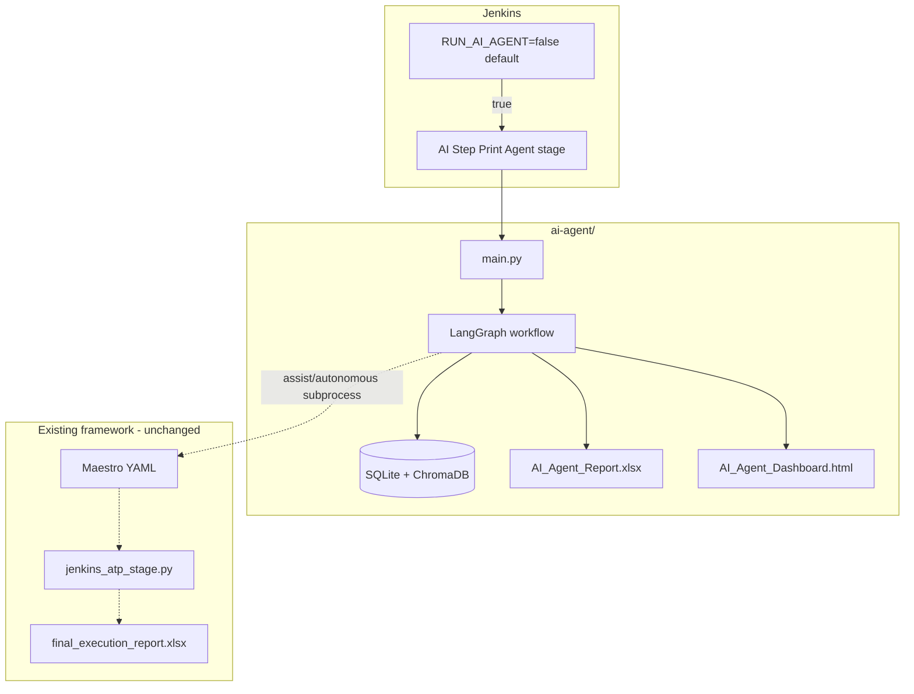

# AI Step Print Agent — Architecture

## Overview

The AI Step Print Agent is an optional, isolated module that behaves like other ATP modules (Camera, Connection, Settings) but uses a **multi-agent LangGraph workflow** instead of replacing Maestro.

## Multi-agent pipeline

```mermaid
flowchart LR
    K[Knowledge Agent] --> MEM[Memory Agent]
    MEM --> PL[Planner Agent]
    PL --> EX[Execution Agent]
    EX --> V[Vision Agent]
    V --> OCR[OCR Agent]
    OCR --> SC[Screen Classifier]
    SC --> DEC[Decision Agent]
    DEC --> REC[Recovery Agent]
    REC --> FA[Failure Analysis]
    FA --> RECO[Recommendation]
    RECO --> REP[Reporting Agent]
```

## Decision inputs

| Source | Module |
|--------|--------|
| UIAutomator XML | `ui_parser/hierarchy_parser.py` |
| OCR | `ocr/ocr_engine.py` |
| Screenshot CV | `vision/screen_capture.py` |
| ADB state | `integrations/adb_client.py` |
| App rules | `config/app_kodak_step_print.yaml` |
| Historical memory | `memory/sqlite_store.py` |
| Vector retrieval | `memory/vector_store.py` |
| LLM advisory | `integrations/llm_client.py` |

## Execution modes

### Observe
Vision + OCR + classification + decision logging. No ADB taps, no Maestro subprocess.

### Assist (default)
Runs one Maestro flow per session. On failure, Decision + Recovery agents attempt bounded recovery.

### Autonomous
Planner selects module; Execution agent drives Maestro + Recovery uses ADB for corrective actions.

## Memory model

**SQLite** (`agent_memory.db`):
- `knowledge` — modules, flows, popups, recoveries
- `decisions` — timestamped decision audit
- `executions` — session summaries
- `scan_manifest` — project scan hash for incremental learning

**ChromaDB** (optional): semantic retrieval over flow/popup text.

## Learning phase

On first run (or when repo hash changes), `learning/project_scanner.py`:
1. Scans `ATP TestCase Flows/**`
2. Indexes tap/assert targets per case
3. Reads Jenkins stage names
4. Persists manifest to SQLite + vector store

No manual mapping required.

## Scalability

Application-specific config: `config/app_kodak_step_print.yaml`

Future apps (Kodak Smile, HP500, Photobooth): add new `app_*.yaml` and set `agent.app_id` — core agents unchanged.

## Fault tolerance

- LangGraph optional — sequential fallback in `graph/workflow.py`
- LLM optional — rule engine when `OPENROUTER_API_KEY` missing
- ChromaDB optional — SQLite-only mode
- Recovery bounded by `max_recovery_attempts` in config

## Jenkins integration

| Parameter | Default | Effect |
|-----------|---------|--------|
| `RUN_AI_AGENT` | `false` | Stage skipped entirely |
| `AI_AGENT_MODE` | `assist` | Passed to agent |

Flag: `ai_agent_failed.flag` → build UNSTABLE (does not fail install/precheck).

## Reporting separation

Existing `build-summary/final_execution_report.xlsx` is **never modified**.

AI outputs:
- `ai-agent/reports/AI_Agent_Report.xlsx`
- `ai-agent/reports/AI_Agent_Dashboard.html`
- `ai-agent/reports/execution_summary.json`

## Future roadmap

1. Warm-start Maestro wrappers for assist mode (no per-flow clearState)
2. Per-module autonomous journeys from scanned YAML intents
3. Flaky test detector from decision log trends
4. Cross-app profile loader for Smile / HP500
5. Real-time Jenkins Blue Ocean panel from dashboard HTML
