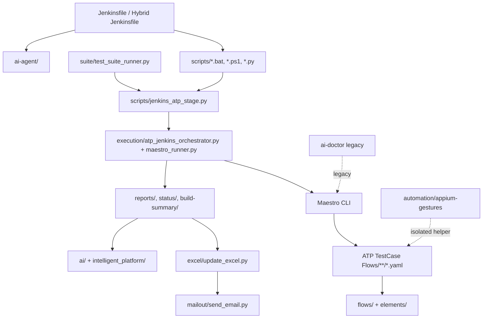

# Enterprise Automation Phase 1 Audit

Status: Phase 1 audit-only deliverable  
Date: 2026-06-27  
Scope: Kodak Step Print Android Maestro automation framework

## Executive Summary

This framework is a production Maestro-first Android automation platform with Python orchestration, Jenkins CI, AI-assisted diagnostics, Excel/email reporting, and an isolated Appium gesture helper. The current system is already operational and contains strong production-minded safeguards: device isolation, Jenkins credential handling, YAML validation, suite continuation after module failures, optional AI recovery, and documented rollback strategies.

The primary enterprise risk is not a single broken component. It is architectural drift: several generations of runners, AI tools, report writers, device discovery utilities, and configuration surfaces coexist. A safe path to a 10/10 enterprise platform is adapter-first consolidation, not replacement.

No code, YAML, Jenkins behavior, CLI behavior, report schema, ATP, AI behavior, device handling, or execution order was changed for this phase.

## Baseline Verification

Offline verification observed during audit:

| Check | Result |
| --- | --- |
| `python -m pytest intelligent_platform/tests ai/tests -q` | 8 passed |
| `python scripts/validate_maestro_yaml.py "ATP TestCase Flows"` | 414 Maestro YAML files OK |
| Python compileall over main Python packages | Clean |

Device smoke, full Maestro execution, and Jenkins execution were not run because they require connected devices, Maestro runtime, and CI context.

## Repository Inventory

| Asset Type | Count Observed | Notes |
| --- | ---: | --- |
| YAML/YML | 501 | Maestro flows, configs, AI prompts/configs |
| Python | 157 | Orchestration, AI, reporting, utilities |
| Batch/PowerShell/Shell | 68 | Jenkins/local execution wrappers |
| Java | 6 | Isolated Appium gesture module |
| JavaScript/MJS | 24 | Legacy AI Doctor and utilities |

## Architecture Diagram

## Current Execution Flow

Production Jenkins ATP path:

1. Jenkins parameters select ATP module and runtime settings.
2. Jenkins invokes Windows helper scripts for install, precheck, and device discovery.
3. `scripts/jenkins_atp_stage.py all <folder> <app> <clear_state> <maestro>` validates and runs a module.
4. `execution.atp_jenkins_orchestrator` schedules flows/devices.
5. `execution.maestro_runner` invokes `scripts/run_one_flow_on_device.bat`.
6. Maestro runs `maestro --device <serial> test <flow>` using the repository workspace/config.
7. Artifacts are written to `reports/`, `status/`, and `build-summary/`.
8. Excel, build summary, failure artifacts, optional AI analysis, and optional email are generated.

Complete suite path:

1. `scripts/run_complete_suite.bat` or `python -m suite.test_suite_runner` starts the suite.
2. `suite/flows/MasterSetup.yaml` runs once when enabled.
3. Modules from `suite/config/suite_modules.yaml` run sequentially through the existing Jenkins ATP stage path.
4. Optional AI recovery retries failed modules within configured bounds.
5. Suite summary artifacts are generated.

## Ownership Map

| Area | Current Owner Layer |
| --- | --- |
| ATP behavior | `ATP TestCase Flows/` |
| Shared Maestro actions | `flows/`, `elements/` |
| Jenkins orchestration | `Jenkinsfile`, `Jenkinsfile.hybrid.gcp-windows` |
| ATP execution | `scripts/jenkins_atp_stage.py`, `execution/` |
| Complete suite orchestration | `suite/` |
| AI failure analysis | `ai/`, `intelligent_platform/` |
| Optional assist/autonomous agent | `ai-agent/` |
| Legacy doctor tooling | `ai-doctor/` |
| Excel/report merge | `excel/`, `scripts/generate_*`, `mailout/` |
| Gesture support | `automation/appium-gestures/` |
| Device utilities | `utils/`, `execution/device_*`, `scripts/windows_agent/` |

## Duplicate Functionality Map

| Capability | Current Implementations | Risk |
| --- | --- | --- |
| Maestro execution | `execution/run_parallel_devices.py`, `execution/maestro_runner.py`, `scripts/run_one_flow_on_device.bat`, `ai-doctor` runner | Behavior drift |
| AI analysis/recovery | `ai/`, `intelligent_platform/`, `ai-agent/`, `ai-doctor/` | Conflicting recommendations/retries |
| Reporting | `excel/update_excel.py`, `scripts/generate_excel_report.py`, `suite/summary_report.py`, `ai-agent/reporting/`, `mailout/` | Schema drift |
| Device discovery | Jenkins scripts, `execution/run_parallel_devices.py`, `utils/device_utils.py`, `ai-agent/integrations/adb_client.py` | Device mismatch |
| Configuration | `config.yaml`, `suite/config/suite_modules.yaml`, `ai-agent/config/*.yaml`, Jenkins params, env vars | Misconfiguration |
| Retry/recovery | Runner startup retries, suite AI retry, ai-agent recovery, legacy doctor retry, Maestro waits | Hard-to-debug reruns |

## Critical Issues

No critical defect was found that justifies immediate behavior-changing work.

The critical architectural risk is execution-path drift. Multiple components can run Maestro, discover devices, retry, analyze failures, and report results. Future changes must be made behind compatibility adapters and validated across all public entrypoints.

## Major Issues

| Issue | Why It Matters | Benefit of Fix | Risk | Backward Compatibility |
| --- | --- | --- | --- | --- |
| No single execution pipeline | Multiple production-capable paths can diverge | Safer changes, clearer ownership | High if replaced directly | Yes, adapter-first only |
| Distributed configuration | Timeouts, AI, paths, devices, reports spread across files/env/Jenkins | Easier support and CI portability | Medium | Yes, with legacy-key mapping |
| Static waits remain widespread | Slower execution and potential flakes | Faster, more stable flows | Medium | Needs module-by-module review |
| AI layers overlap | Duplicated analysis/recovery logic | Simpler support model | Medium | Keep legacy entrypoints |
| Runtime artifacts in workspace | Noisy audit, large stashes, accidental archival | Cleaner CI and repo hygiene | Low | Yes, cleanup policy only |

## Minor Issues

- Some docs contain mojibake characters such as `—`.
- Naming varies across module labels and folders, for example `SignIn`, `signup-login`, `SignUp_Login`, `PreCut`, and `precut`.
- Root-level screenshots, videos, XML dumps, and probe artifacts appear to be generated outputs.
- `New folder/`, `_archive6_extract/`, and `.video_frames_*` look like generated or archive workspaces and should be reviewed before cleanup.
- Report schemas are useful but not governed by one manifest/model.

## Best Practices Already Present

- Strong backward-compatibility posture in suite documentation.
- Maestro YAML preflight validator exists and passes offline.
- Jenkins credentials are used for OpenRouter and SMTP instead of hardcoded secrets.
- Device-specific Maestro isolation and startup diagnostics exist.
- Thread-safe Excel append exists.
- AI recovery is optional and bounded by config.
- Suite modules are declarative in `suite/config/suite_modules.yaml`.
- Prior performance work is documented in `docs/ATP_RUNTIME_BOTTLENECK_REPORT.md` with rollback strategy.

## Technical Debt Report

| Debt | Priority | Recommended Handling |
| --- | --- | --- |
| Multiple runners and schedulers | Critical | Define canonical pipeline contract, keep wrappers |
| Multiple AI stacks | High | Mark ownership and compatibility, consolidate later |
| Config duplication | High | Add `ConfigurationManager` with compatibility mapping |
| Report fragmentation | High | Add additive report manifest first |
| Static waits | Medium | Use timing evidence and adjust one module at a time |
| Legacy/generated folders | Medium | Inventory and cleanup only after source-of-truth review |
| Encoding artifacts in docs | Low | Safe doc cleanup pass |

## Dead Code / Legacy Candidate Report

Do not delete any of these without review.

| Candidate | Assessment |
| --- | --- |
| `ai-doctor/` | Legacy/overlapping; keep compatibility entrypoints |
| `New folder/` | Old/generated flow workspace candidate |
| `_archive6_extract/` | Archive/generated candidate |
| Root `ED_*.png`, `probe_*.png`, `window_dump*.xml` | Runtime artifact candidates |
| Empty root `cd` file | Likely accidental; verify before removal |
| `.video_frames_*` | Generated video-frame artifacts |
| Duplicate permission CSV/JSON docs | Identify source of truth before cleanup |

## Security Review

Good controls:

- `.env` files are ignored.
- `.env.example` exists.
- Jenkins credential binding is used for OpenRouter and SMTP.
- AI analysis can run in no-key mode.

Risks:

- Many aliases for SMTP/OpenRouter env vars increase configuration mistakes.
- Logs may contain device names, local paths, generated emails, and failure context.
- Artifacts at repo root could be accidentally shared or archived.
- Legacy AI memory should be treated as auditable runtime data.

Recommended safe improvements:

1. Add log redaction guidelines.
2. Add artifact retention and cleanup documentation.
3. Add a report manifest that clearly identifies public vs diagnostic artifacts.
4. Add a secrets/env variable matrix.

## Performance Review

Primary bottlenecks:

- Maestro startup and device driver IPC.
- Cold-start `clearState` flows where required for isolation.
- Static `waitForAnimationToEnd` usage.
- ADB/device discovery and reconnection.
- Screenshot/video/log artifact volume.
- Excel/report generation over large runs.

Existing mitigations:

- Device-specific Maestro runtime isolation.
- Startup diagnostics and retry handling.
- Flow timing instrumentation.
- Runtime bottleneck report with prior optimization history.

Do not change waits or `clearState` behavior globally without per-module validation.

## Reliability Review

Main flake sources:

- Mobile permission dialogs and OS-specific popups.
- Bluetooth/printer discovery timing.
- Gallery/media loading timing.
- Maestro driver startup and local port collisions.
- Static waits that are either too short on slow devices or wasteful on fast devices.
- Multiple retry layers obscuring root cause.

Recommended approach:

1. Keep current behavior unchanged.
2. Collect timing/failure data per module.
3. Replace waits only where evidence shows safe improvement.
4. Add diagnostics before retries, not after.
5. Keep AI recovery bounded and auditable.

## Scalability Review

Current scalability is strong for Jenkins + local USB device farms and moderate for enterprise/cloud scale.

Strengths:

- Multi-device concepts exist.
- Per-module suite configuration exists.
- Device isolation exists.
- Jenkins stash exclusions and cleanup scripts exist.

Gaps:

- No single scheduler abstraction.
- Cloud device farm execution is not a first-class target.
- No central report history/trend model.
- Module tags such as smoke/sanity/regression/device-required are not fully standardized.

## Maintainability Review

The framework is powerful but cognitively heavy. A contributor must understand Maestro YAML, Windows batch wrappers, Python orchestration, Jenkins CPS limits, AI recovery, Excel/report generation, and device runtime behavior.

The path to enterprise maintainability is documentation, compatibility contracts, adapters, and quality gates before refactoring.

## Compatibility Matrix

| Surface | Current Status | Change Policy |
| --- | --- | --- |
| ATP YAML | Production critical | Do not change without explicit approval and Maestro docs cross-check |
| Shared flows | Production critical | Change only with validation and rollback |
| Jenkins parameters | Public API | Do not rename or remove |
| CLI commands | Public API | Do not change behavior |
| Reports | Public contract | Additive only |
| Environment variables | Public contract | Add aliases, never remove existing keys |
| AI recovery | Behavioral surface | Do not change decisions/retry behavior yet |
| Device handling | Behavioral surface | Do not change scheduling/isolation yet |
| Legacy tools | Compatibility surface | Keep, wrap, or document |

## Risk Register

| Risk | Severity | Mitigation |
| --- | --- | --- |
| Execution path drift | Critical | Canonical pipeline contract and compatibility tests |
| Jenkins regression | High | Preserve parameters, stages, and wrappers |
| Maestro behavior regression | High | Cross-check official docs before YAML/script changes |
| AI recovery changes outcomes | High | Contract tests before consolidation |
| Device handling regressions | High | Preserve current ADB/Maestro isolation |
| Report schema drift | Medium | Add manifest, keep existing files unchanged |
| Secret leakage in logs | Medium | Redaction policy and artifact classification |
| Artifact bloat | Medium | Cleanup policy and CI stash rules |
| Legacy code confusion | Medium | Mark ownership before deprecation |

## Phase 2 Architecture Targets

Classify future changes as follows:

| Target | Classification | Notes |
| --- | --- | --- |
| Architecture/ownership documentation | SAFE | Documentation only |
| Compatibility matrix | SAFE | Documentation/test planning only |
| Non-blocking quality gate scripts | SAFE | Must not affect production execution initially |
| Additive report manifest | SAFE | Do not change current reports |
| `ConfigurationManager` | NEEDS REVIEW | Must support all legacy keys |
| `ExecutionContext` | NEEDS REVIEW | Adapter-first; no behavior replacement |
| Central `ReportManager` | NEEDS REVIEW | Additive first |
| Static wait replacement | NEEDS REVIEW | Per-module evidence required |
| Remove legacy code | DO NOT CHANGE | Only after compatibility layer and approval |
| Rename folders/APIs/env vars | DO NOT CHANGE | Public contract |

## Improvement Roadmap

### Quick Wins

| Improvement | Risk | Compatibility |
| --- | --- | --- |
| Add architecture and ownership docs | Low | 100% |
| Add report artifact manifest documentation | Low | 100% |
| Fix documentation encoding artifacts | Low | 100% |
| Add non-blocking quality gate command list | Low | 100% |
| Inventory generated/runtime artifacts | Low | 100% |

### High-Impact Improvements

| Improvement | Risk | Compatibility |
| --- | --- | --- |
| Canonical pipeline contract | Medium | Adapter-first |
| Configuration compatibility map | Medium | Legacy keys retained |
| Report model/manifest | Medium | Additive only |
| Device manager facade | Medium | Existing discovery retained |
| AI manager facade | Medium | Existing AI behavior retained |

### Long-Term Improvements

| Improvement | Risk | Compatibility |
| --- | --- | --- |
| Cloud device farm integration | Medium | Add separate runner target |
| Historical trend dashboard | Low/Medium | Additive reports |
| Test impact analysis | Medium | Advisory only first |
| Self-healing locator suggestions | High | Suggest-only until proven |
| Plugin architecture | Medium | Adapter-first |

## Rollback Plan

For documentation-only changes, rollback is deleting the new documentation file.

For future executable changes:

1. Keep legacy entrypoints intact.
2. Add adapters behind feature flags or internal calls.
3. Validate offline checks first.
4. Validate one module on one device.
5. Validate full Jenkins path.
6. Revert only the additive adapter or feature flag if issues occur.

## Final Phase 1 Conclusion

The framework is production-capable and already contains serious engineering work around Maestro reliability, Jenkins execution, reporting, and AI-assisted recovery. The path to a 10/10 enterprise platform is not a rewrite. It is a controlled migration toward one canonical pipeline, one compatibility-aware configuration layer, one additive reporting model, and documented ownership boundaries.

Recommended next step: Phase 2 architecture proposal, with every candidate change marked `SAFE`, `NEEDS REVIEW`, or `DO NOT CHANGE` before implementation.
